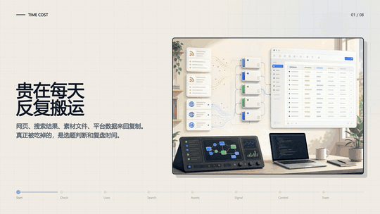
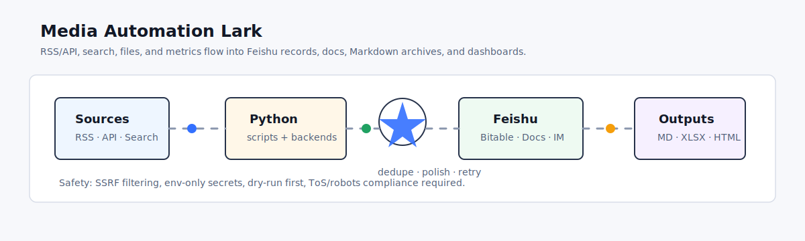

# Media Automation Lark

<p align="center">
  <a href="https://github.com/mianbaofang/media-automation-lark/releases/tag/v0.2.0">
    
  </a>
</p>

<p align="center">
  <a href="README.md">中文 README</a>
  ·
  <a href="SKILL.md">Skill</a>
  ·
  <a href="DISCLAIMER.md">Disclaimer</a>
  ·
  <a href="ACKNOWLEDGEMENTS.md">Acknowledgements</a>
  ·
  <a href="RELEASE.md">Release notes</a>
  ·
  <a href="CHANGELOG.md">Changelog</a>
  ·
  <a href="SECURITY.md">Security</a>
  ·
  <a href="reports/project-audit.md">Audit report</a>
</p>

## Why This Project Exists

When running a content account, the exhausting part is often not one single creative task. It is the small daily transfer work: opening different platforms for topics, saving web pages, RSS items, PDFs, images, and spreadsheets, then syncing metrics, materials, and follow-up tasks into Feishu/Lark.

Each step is simple on its own, but together they fragment attention. Materials end up scattered across downloads, chats, and browser bookmarks. Metric review turns into copy-paste. A topic can move from search to fetch to cleanup to archive before anyone has really judged whether it is worth doing.

I built this project to put those repeated transfers into a local, previewable workflow: preview locally first, then decide whether to fetch, convert, analyze, and write to Feishu/Lark. People keep the judgment, taste, and creative choices; scripts handle the repeated movement that should not consume attention every day.

A local automation toolkit that connects content ingestion, search collection, material analysis, analytics dashboards, and Feishu/Lark archiving. It uses Python scripts to orchestrate RSS/API inputs, optional search backends, file-to-Markdown conversion, LLM extraction, and `lark-cli` writes to Bitable, Docs, and bot notifications.

Please read [DISCLAIMER.md](DISCLAIMER.md) before using this project. This project is for learning and research only. Any crawling, web fetching, or platform data collection must comply with applicable law, platform Terms of Service, and robots.txt.

## Workflow Overview

<p align="center">
  
</p>

The workflow is designed around daily content-ops cost: search, fetch, material intake, metric review, and Feishu/Lark sync are handled as a previewable, dry-runnable, schedulable loop. People keep the judgment work; scripts take the repeated transfer work.

## What It Does

| Workflow | Script | Output |
|---|---|---|
| Content archiving | `scripts/content-archiver.py` | RSS/API content structured into Feishu Bitable |
| Metrics dashboard | `scripts/data-collector.py` | Platform metrics, `dashboard.html`, `metrics.xlsx`, optional Feishu sync |
| Material management | `scripts/material-manager.py` | Articles, images, PDFs, and Office files converted/analyzed and archived to Feishu Docs |
| Search collection | `scripts/collector.py` | Search results fetched, categorized, and saved as Markdown, with optional Feishu archive |

## Quick Start

```bash
python -m venv .venv
.venv\Scripts\activate
pip install -r requirements.txt
python scripts/env-check.py --gen-config
copy config.json.example config.json
```

Edit `config.json`:

- Feishu/Lark: set `feishu.app_token`, table IDs, and optional `chat_id`.
- LLM: keep `@env:LARK_LLM_API_KEY` and provide `LARK_LLM_API_KEY` in your environment.
- Platforms: set `platforms.bilibili.mid` for Bilibili metrics, or import metrics via `--source`.

Install and authorize `lark-cli` before writing to Feishu:

```bash
npm install -g @larksuite/cli
lark-cli config init
lark-cli auth login --recommend
```

## Beginner Entry: Ask An Agent To Open The Panel

End users do not need to memorize script arguments. In an Agent that supports this Skill, ask it to "open the Media Automation Lark panel" or "check my environment first". The Agent should launch the local panel and return the URL.

The default panel URL is <http://127.0.0.1:8787>. The panel defaults to local preview. It exposes six plain-language tasks: check readiness, try a safe sample run, organize a webpage or file, collect public content by topic, archive RSS updates, and generate dashboards before scheduling. Feishu writes only run when you explicitly check "write to Feishu".

## Safe Sample Run

If you are not sure what the project produces, run the built-in sample first. It uses no network and writes nothing to Feishu:

```bash
python scripts/collector.py --offline-demo --category-map "AI:LLM,Agent;Product:growth" --output-dir output_demo --no-archive --no-notify --no-polish
```

Then open `output_demo/index.md`. Once the output shape feels right, switch to real webpages, files, RSS feeds, or search topics.

## Common Commands

```bash
python scripts/env-check.py
python scripts/install_backends.py --interactive
python scripts/content-archiver.py --rss-url "https://example.com/feed.xml" --dry-run
python scripts/collector.py --query "LLM applications" --source-scope bilibili --rank-by hotness --category-map "AI:LLM,Agent" --dry-run
python scripts/data-collector.py --fetch --platform bilibili --dry-run
python scripts/material-manager.py --file "./report.pdf" --dry-run
python -m pytest tests
```

## Backends

Backends are detected at runtime. Installed backends are used; missing backends are skipped:

- `anysearch`: search + extraction, no key required.
- `tavily`: search + extraction, requires `TAVILY_API_KEY` or `tvly login`.
- `autocli`: reads authenticated browser pages into Markdown.
- `agent-reach` / `multi-search-engine`: interactive mode only.
- `http`: built-in requests + BeautifulSoup fallback.

See [references/search-backends.md](references/search-backends.md).

In the panel, search collection asks for source scope, topic list, and ranking goal. Hotness ranking only uses publicly visible signals in search-result text, such as reads, views, plays, likes, saves, comments, or shares. If those signals are unavailable, it falls back to relevance.

## Safety

- URL inputs are filtered by `common.is_safe_url` to block `file://`, localhost, link-local, cloud metadata, and private-network addresses.
- Secrets are read from environment variables or `@env:` placeholders. `config.json` and `.env` are ignored by Git.
- Feishu writes support `--dry-run`; use it first.
- Captured article bodies are preserved by default. Only generated summaries, index text, and notifications are polished.
- The project is not intended to bypass captchas, paywalls, logins, encryption, or platform anti-abuse systems.

## Acknowledgements

This project builds on the following open-source projects and tool ecosystems:

- Python data and parsing ecosystem: `requests`, `feedparser`, `beautifulsoup4`, `pandas`, `openpyxl`, `python-docx`, and `PyPDF2`.
- File-to-Markdown conversion: Microsoft [`markitdown`](https://github.com/microsoft/markitdown).
- Optional search / fetch backends: [`anysearch-skill`](https://github.com/anysearch-ai/anysearch-skill), [`AutoCLI`](https://github.com/nashsu/AutoCLI), and [`Agent-Reach`](https://github.com/Panniantong/Agent-Reach).
- Optional search services and toolchains: Tavily CLI / API, Feishu/Lark Open Platform, and `@larksuite/cli`.
- Demo video pipeline: HyperFrames timeline animation and MiniMax CLI background music generation.

## Release Materials

- Chinese README: `README.md`
- Disclaimer: `DISCLAIMER.md`
- Release notes: `RELEASE.md`
- Changelog: `CHANGELOG.md`
- Contributing guide: `CONTRIBUTING.md`
- Security policy: `SECURITY.md`
- Acknowledgements: `ACKNOWLEDGEMENTS.md`
- License: `LICENSE`
- Issue / PR templates: `.github/`
- Launch checklist: `reports/github-launch-checklist.md`
- Acknowledgements: `ACKNOWLEDGEMENTS.md`
- HyperFrames timeline video source: `hyperframes/media-automation-lark-timeline/`
- MiniMax CLI background music: `hyperframes/media-automation-lark-timeline/assets/audio/minimax-bgm.mp3`
- README demo GIF: `assets/media-automation-lark-demo.gif`
- Lightweight workflow animation: `assets/media-automation-lark-flow.svg`
- Static workflow image: `media-automation-skill-workflow.png`
- Agent panel entrypoint: `scripts/panel-agent.py`

## Status

Current public version: [`v0.2.0`](https://github.com/mianbaofang/media-automation-lark/releases/tag/v0.2.0).

- Verification: `python -m pytest tests`.
- Animation: the README uses a lightweight GIF preview; the music-backed MP4 is attached to the `v0.2.0` GitHub Release.
- Source: the HyperFrames timeline source lives in `hyperframes/media-automation-lark-timeline/`.

License: MIT, see [LICENSE](LICENSE).
