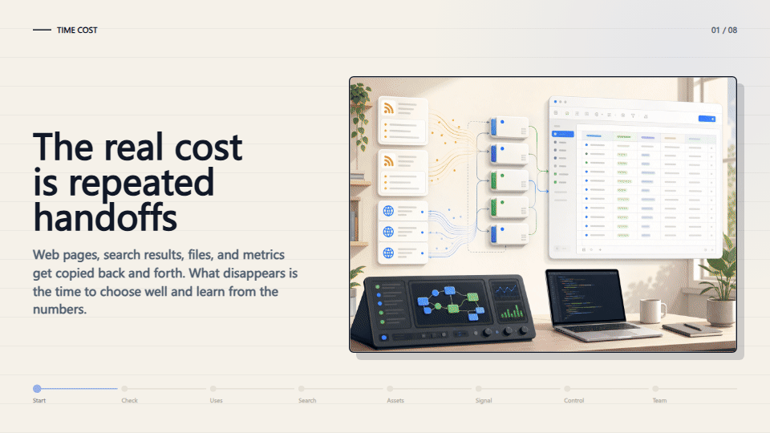
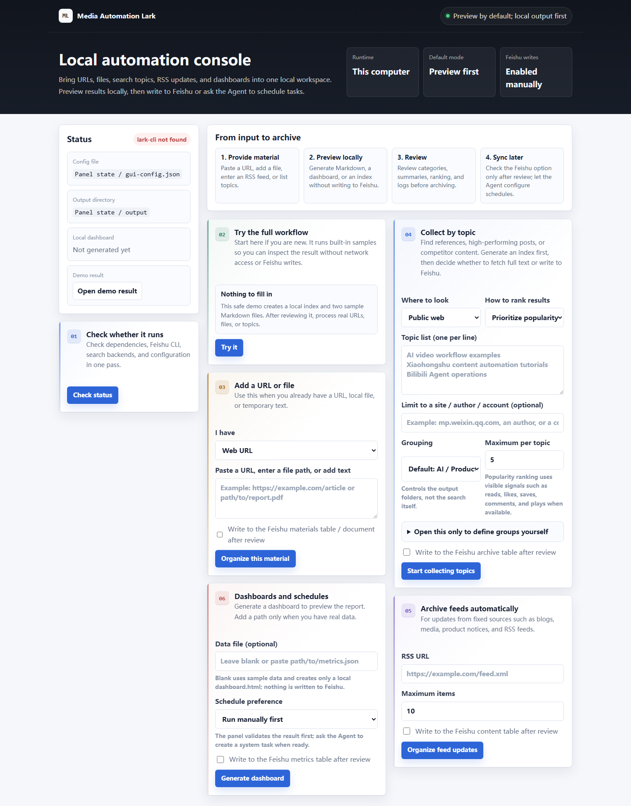
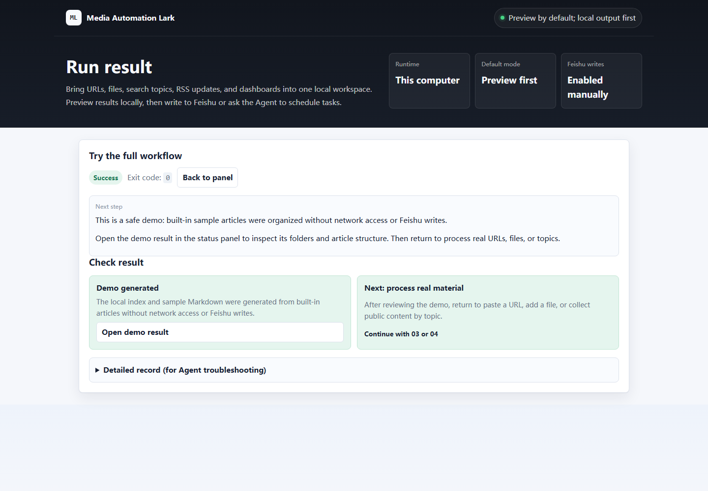
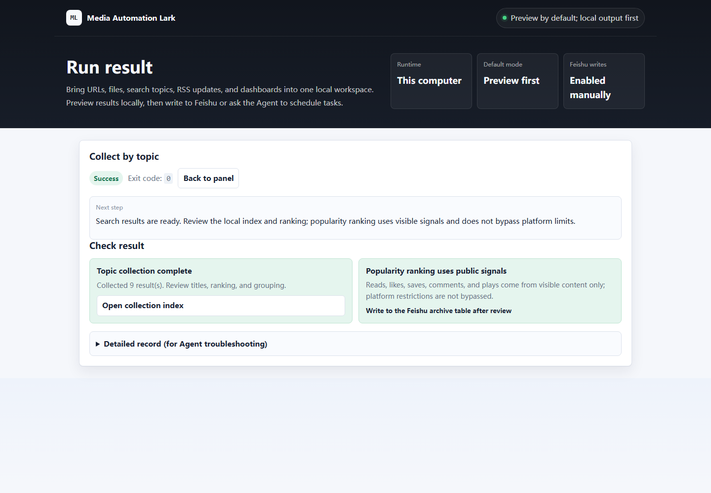
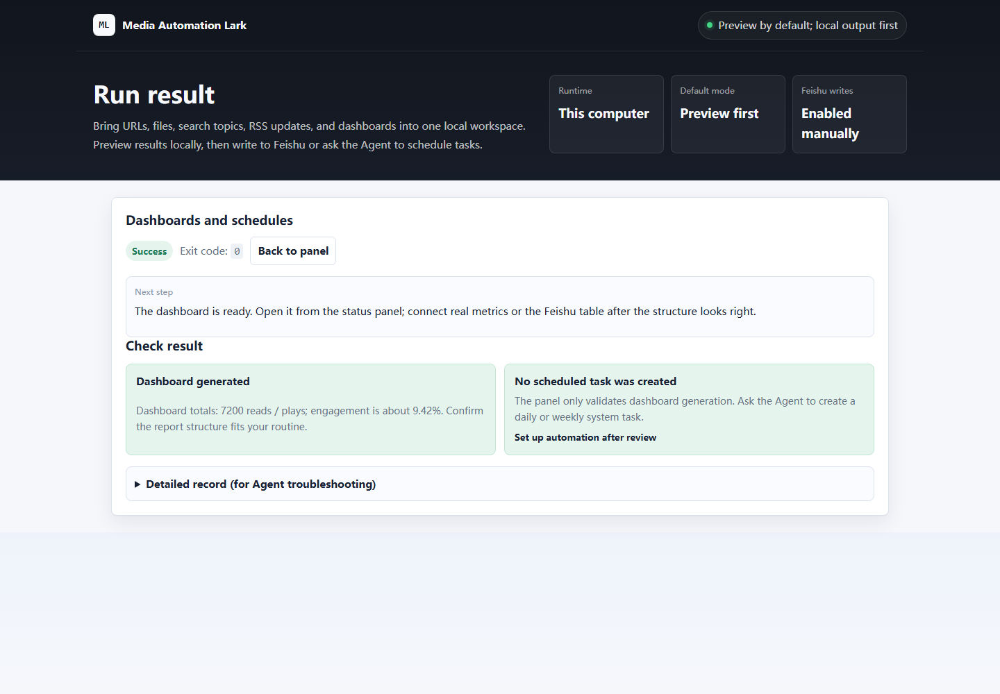

# Media Automation Lark

A local content-automation toolkit for creators and small teams. It supports Feishu content automation and a practical Lark content workflow: collect RSS/API feeds, public web searches, webpages and files, and platform metrics; produce Markdown, Excel/HTML dashboards; and optionally write reviewed results to Feishu/Lark Bitable, Docs, and bot notifications. A common use case is RSS to Feishu archiving.

<table align="center"><tr><td><a href="https://github.com/mianbaofang/media-automation-lark/releases"></a></td><td><a href="https://github.com/mianbaofang/media-automation-lark/blob/main/LICENSE"></a></td><td><a href="https://github.com/mianbaofang/media-automation-lark/stargazers"></a></td></tr></table>

<p align="center">
  <a href="hyperframes/media-automation-lark-timeline/index.html?lang=en">
    
  </a>
</p>

<p align="center">    </p>

<p align="center">
  <a href="README.md">中文 README</a>
  ·
  <a href="skills/media-automation-lark/SKILL.md">Installable Skill</a>
  ·
  <a href="hyperframes/media-automation-lark-timeline/index.html?lang=en">Demo source</a>
  ·
  <a href="DISCLAIMER.md">Disclaimer</a>
  ·
  <a href="ACKNOWLEDGEMENTS.md">Acknowledgements</a>
  ·
  <a href="RELEASE.md">Release notes</a>
  ·
  <a href="CHANGELOG.md">Changelog</a>
  ·
  <a href="SECURITY.md">Security</a>
  ·
  <a href="reports/project-audit.md">Audit report</a>
</p>

## Quick Start

Run the offline demo first to inspect the output shape. It needs no network access, Feishu permission, or API key:

```bash
python scripts/collector.py --offline-demo --category-map "AI:LLM,Agent;Product:growth" --output-dir output_demo --no-archive --no-notify --no-polish
```

Open `output_demo/index.md`. For the full workflow, install dependencies and generate a local configuration:

```powershell
python -m venv .venv
.venv\Scripts\activate
pip install -r requirements.txt
python scripts/env-check.py --gen-config
copy config.json.example config.json
```

`--offline-demo` uses only the built-in fixture, so it is the no-network way to inspect categorization and Markdown output. It is different from `--dry-run`: a dry run may read real inputs or call public APIs, but it writes local artifacts while skipping Feishu/Lark writes and bot notifications. It is not an offline mode.

For a Bilibili metrics run, copy the configuration first, set `platforms.bilibili.mid` to the account's numeric UID (for example, `"123456"`; it is not a username or API key), and pass the configuration path explicitly:

```powershell
copy config.json.example config.json
```

After editing `config.json`, run:

```bash
python scripts/data-collector.py --config config.json --fetch --platform bilibili --dry-run
```

In an Agent that supports this Skill, ask it to “open the Media Automation Lark panel” or “check my environment first”:

```bash
python scripts/panel-agent.py start --open
```

The default panel URL is <http://127.0.0.1:8787>. It starts in local preview mode; Feishu/Lark writes only happen after you explicitly enable them.

The project does not run a resident scheduler. For scheduled runs, use the host operating system's cron, systemd timer, or Windows Task Scheduler and adapt the templates in [`assets/cron-examples/`](assets/cron-examples/). Run the command manually with `--dry-run` before registering a schedule.

## Why I Built This

When I run a content account, the repeated work is spread across several places: finding topics on different platforms, saving webpages and RSS items, passing PDFs, images, and spreadsheets through separate tools, then manually syncing metrics, material notes, and follow-up tasks into Feishu/Lark.

Bookmarks, download folders, and spreadsheets each solve one small step, but they do not automatically keep content, metrics, and follow-up tasks in one record. A topic can move from search to fetch, cleanup, and archive before anyone has judged whether it is worth pursuing; copying and reformatting happen first.

I built the project around that handoff: webpages and files, public searches, RSS archiving, and metric dashboards first produce local results to inspect; only then does the user choose whether to write to Feishu/Lark. Repeated runs can be assigned to the host operating system's scheduler. People keep judgment, trade-offs, and creative decisions; scripts handle the repeated organizing, conversion, and syncing.

This is a local-first Feishu/Lark content-automation toolkit, not a hosted publishing platform. It combines search collection, webpage and file intake, metrics dashboards, Markdown archiving, and optional Feishu/Lark sync into a previewable, dry-runnable, schedulable workflow for individual creators and small content teams.

> Read [DISCLAIMER.md](DISCLAIMER.md) before use. Web fetching, search collection, and platform data collection must comply with applicable law, platform Terms of Service, and robots.txt. This project does not bypass logins, captchas, paywalls, or platform controls.

## At A Glance

<p align="center">
  
</p>

The workflow covers four everyday jobs: content archiving, search collection and categorization, multimodal material management, and platform metrics dashboards. Each step supports a dry run before anything is written to Feishu/Lark.

## Product Screenshots

These screenshots were captured from the product's local control panel and its output views on August 16, 2026. They document the panel as it existed at capture time and are illustrative only; they do not claim to represent the current release. The English set below was captured with the panel's `--lang en` mode.

<table align="center"><tr><td></td></tr></table>
<table align="center"><tr><td></td><td></td></tr></table>
<table align="center"><tr><td></td></tr></table>

## What It Does

| Workflow | Script | Output |
|---|---|---|
| Content archiving | `scripts/content-archiver.py` | RSS/API content structured into Feishu Bitable |
| Metrics dashboard | `scripts/data-collector.py` | Platform metrics, `dashboard.html`, `metrics.xlsx`, with optional Feishu sync |
| Multimodal material management | `scripts/material-manager.py` | Articles, images, PDFs, and Office files converted to Markdown and archived to Feishu Docs |
| Search collection | `scripts/collector.py` | Public web results fetched, categorized, and saved as Markdown, with optional Feishu archive |

## Common Commands

```bash
# Environment check
python scripts/env-check.py

# Install optional search/conversion backends
python scripts/install_backends.py --interactive

# Archive an RSS feed; start with a dry run
python scripts/content-archiver.py --rss-url "https://example.com/feed.xml" --dry-run

# Collect and categorize search results as Markdown
python scripts/collector.py --query "LLM applications" --source-scope bilibili --rank-by hotness --category-map "AI:LLM,Agent" --dry-run

# Fetch metrics for Bilibili only (after setting the numeric mid above)
python scripts/data-collector.py --config config.json --fetch --platform bilibili --dry-run

# Intake a material file
python scripts/material-manager.py --file "./report.pdf" --dry-run

# Run tests
python -m pytest tests
```

The panel asks users to choose a source scope, collection list, and ranking goal before topic collection. Supported public-source scopes can include public webpages, WeChat public pages, Bilibili, Zhihu, Xiaohongshu, Douyin, and custom sources. Hotness ranking uses only visible signals such as reads, views, plays, likes, saves, comments, or shares; when those signals are absent, it falls back to relevance.

## Search And Fetch Backends

Backends are detected at runtime. Installed backends are used; missing backends are skipped:

- `anysearch`: search and extraction, no key required.
- `tavily`: search and extraction, requires `TAVILY_API_KEY` or `tvly login`.
- `autocli`: reads authenticated browser pages into Markdown.
- `agent-reach` / `multi-search-engine`: interactive mode only; not used by headless scheduled jobs.
- `http`: built-in HTTP + BeautifulSoup fallback.

See [references/search-backends.md](references/search-backends.md).

## Safety And Responsible Use

- URL inputs pass the lightweight `common.is_safe_url` filter for HTTP(S), localhost, cloud-metadata hosts, and literal loopback, link-local, private, or reserved IP addresses. Ordinary hostnames are not DNS-resolved, so this is input filtering and not complete SSRF protection.
- Secrets are read from environment variables or `@env:` placeholders. `config.json` and `.env` are ignored by Git.
- Feishu/Lark writes support `--dry-run`; use it first.
- Captured article bodies are preserved by default. Only generated summaries, index text, and notifications are polished.
- The project is not intended to bypass captchas, paywalls, logins, encryption, or platform anti-abuse systems.

## Acknowledgements

This project builds on the following open-source projects and tool ecosystems:

- Python data and parsing ecosystem: `requests`, `feedparser`, `beautifulsoup4`, `pandas`, `openpyxl`, `python-docx`, and [`pypdf`](https://github.com/py-pdf/pypdf) for PDF fallback extraction.
- File-to-Markdown conversion: Microsoft [`MarkItDown`](https://github.com/microsoft/markitdown), an optional Python tool installed as `markitdown[all]`. Markdown is the output text format, not the tool itself.
- Optional search / fetch backends: [`anysearch-skill`](https://github.com/anysearch-ai/anysearch-skill), [`AutoCLI`](https://github.com/nashsu/AutoCLI), and [`Agent-Reach`](https://github.com/Panniantong/Agent-Reach).
- Optional search services and toolchains: Tavily CLI / API, Feishu Open Platform, and `@larksuite/cli`.
- Demo video pipeline: HyperFrames timeline animation and MiniMax CLI background music generation.

## Repository Layout

```text
scripts/                  Core scripts, including the Agent panel entrypoint
references/               Feishu, API, search-backend, and prompt references
assets/cron-examples/     crontab, systemd, and Windows Task Scheduler examples
skills/media-automation-lark/agents/  Agent and Skill interface descriptions
tests/                    pytest suite
reports/                  Audit records and launch checks
```

## Release Materials

- Chinese README: `README.md`
- English README: `README.en.md`
- Disclaimer: `DISCLAIMER.md`
- Release notes: `RELEASE.md`
- Changelog: `CHANGELOG.md`
- Contributing guide: `CONTRIBUTING.md`
- Security policy: `SECURITY.md`
- Acknowledgements: `ACKNOWLEDGEMENTS.md`
- License: `LICENSE`
- Issue / PR templates: `.github/`
- Launch checklist: `reports/github-launch-checklist.md`
- HyperFrames timeline source: `hyperframes/media-automation-lark-timeline/`
- Chinese README preview: `assets/media-automation-lark-demo.gif`
- English README preview: `assets/media-automation-lark-demo.en.gif`
- Static workflow image: `media-automation-skill-workflow.png`
- Agent panel entrypoint: `scripts/panel-agent.py`
- The only installable Skill package: `skills/media-automation-lark/`, with `skills/media-automation-lark/SKILL.md` as its entrypoint
- Release install assets use the versioned name `media-automation-lark-skill-v<version>.zip` with a matching `.zip.sha256`; GitHub's automatic source ZIP is not the Skill install package

## Status

Current public version: [`v0.2.0`](https://github.com/mianbaofang/media-automation-lark/releases/tag/v0.2.0).

- `v0.3.0` is a local release candidate only; no Git tag or GitHub Release has been created.
- Verification: `python -m pytest tests`.
- Animation: both README previews are verified 960x540, 5 fps, 36-second GIFs under 6 MiB. The music-backed MP4 is promotional media, not a Skill install asset.
- Source: the HyperFrames timeline source remains in `hyperframes/media-automation-lark-timeline/`.

## License

MIT, see [LICENSE](LICENSE).

## Author And Contact

Author: [@mianbaofang](https://github.com/mianbaofang).

Please use [GitHub Issues](https://github.com/mianbaofang/media-automation-lark/issues) for feature requests and usage questions. Report security concerns according to [SECURITY.md](SECURITY.md).
