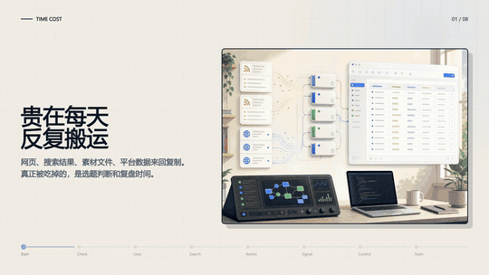
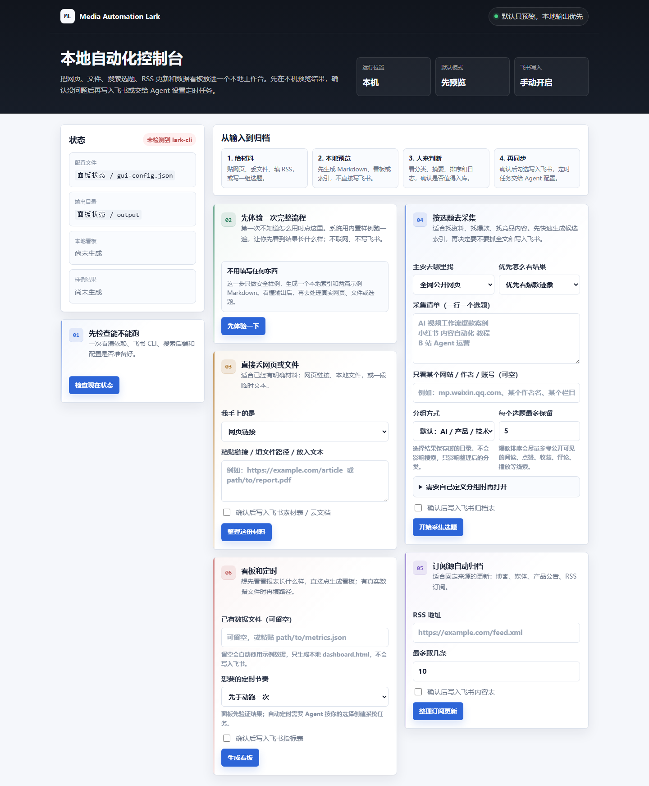
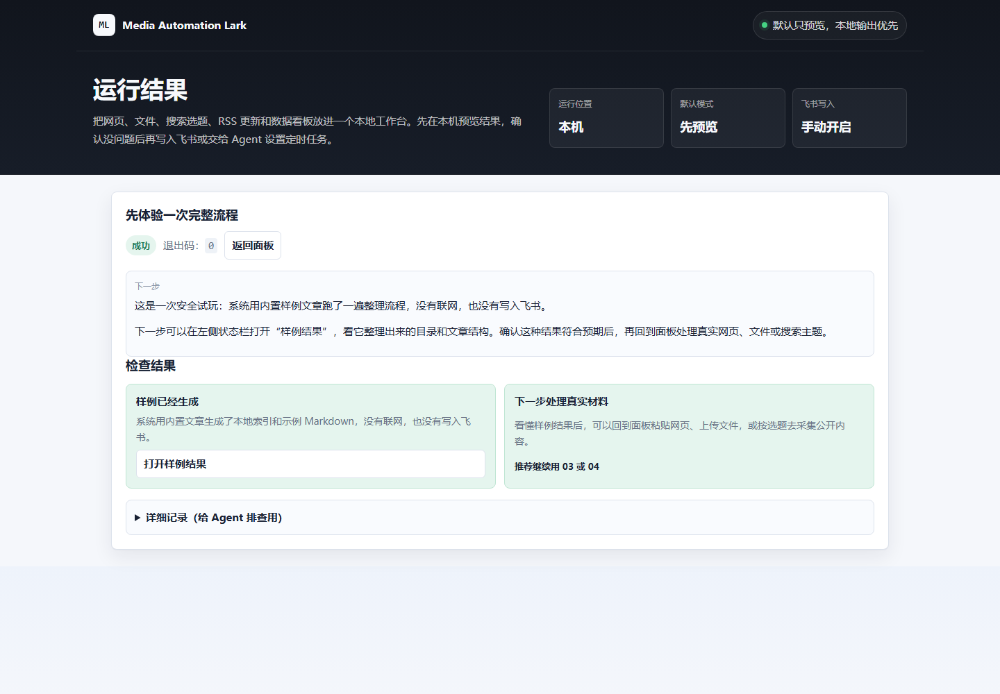
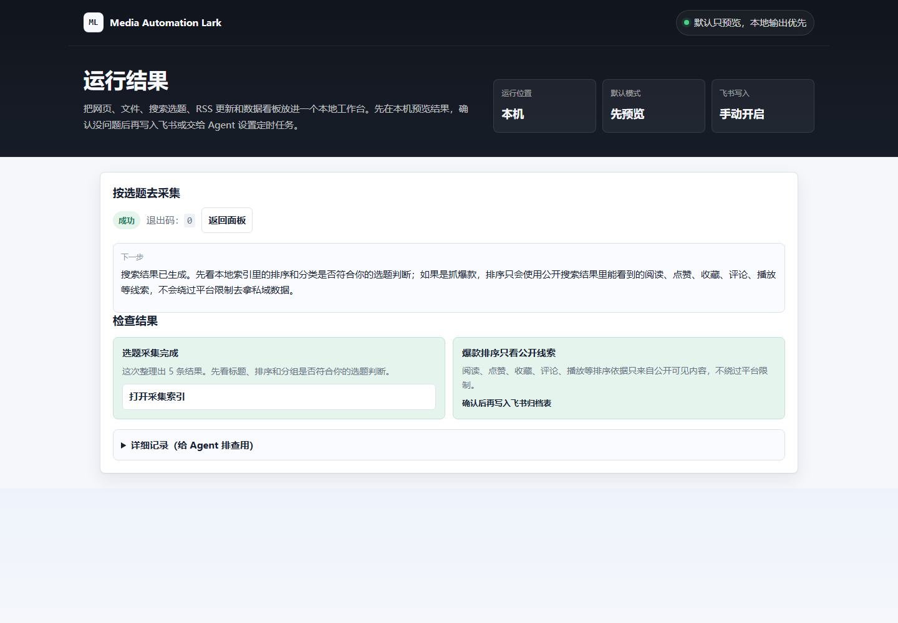
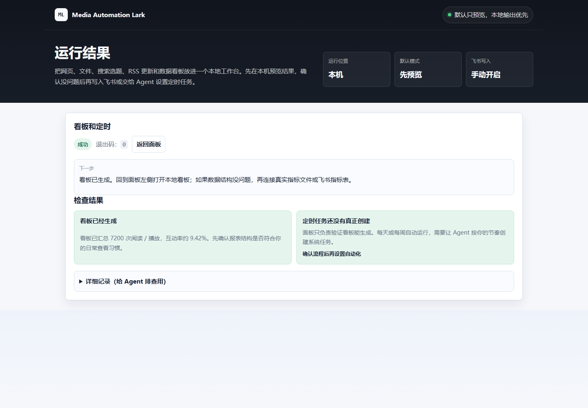

# Media Automation Lark / 自媒体自动化工作流（飞书 CLI 版）

面向内容创作者和小团队的本地内容自动化工具：把 RSS/API、公开网页搜索、网页与文件素材、平台指标整理成 Markdown、Excel/HTML 看板，并按需写入飞书（Feishu/Lark）多维表格、云文档和机器人通知。

如果你要做 Feishu/Lark 内容自动化，把 RSS、公开网页和文件整理后归档，这个工具会先生成本地预览，再由你决定是否写入飞书。

<table align="center"><tr><td><a href="https://github.com/mianbaofang/media-automation-lark/releases"></a></td><td><a href="https://github.com/mianbaofang/media-automation-lark/blob/main/LICENSE"></a></td><td><a href="https://github.com/mianbaofang/media-automation-lark/stargazers"></a></td></tr></table>

<p align="center">
  <a href="hyperframes/media-automation-lark-timeline/index.html">
    
  </a>
</p>

<p align="center">    </p>

<p align="center">
  <a href="README.en.md">English</a>
  ·
  <a href="skills/media-automation-lark/SKILL.md">可安装 Skill</a>
  ·
  <a href="hyperframes/media-automation-lark-timeline/index.html">演示源码</a>
  ·
  <a href="DISCLAIMER.md">免责声明</a>
  ·
  <a href="ACKNOWLEDGEMENTS.md">致谢</a>
  ·
  <a href="RELEASE.md">发布说明</a>
  ·
  <a href="CHANGELOG.md">更新日志</a>
  ·
  <a href="SECURITY.md">安全说明</a>
  ·
  <a href="reports/project-audit.md">审查报告</a>
</p>

## 快速开始

先用离线演示确认输出格式，不需要联网、飞书权限或 API 密钥：

```bash
python scripts/collector.py --offline-demo --category-map "AI:大模型,LLM,Agent;产品:增长" --output-dir output_demo --no-archive --no-notify --no-polish
```

生成后查看 `output_demo/index.md`。准备运行完整流程时，再安装依赖并生成配置：

```powershell
python -m venv .venv
.venv\Scripts\activate
pip install -r requirements.txt
python scripts/env-check.py --gen-config
copy config.json.example config.json
```

这里的 `--offline-demo` 只使用内置样例，专门用于不联网地检查分类和 Markdown 输出；它不同于 `--dry-run`。后者仍可能读取真实输入或访问公开接口，但会生成本地产物并跳过飞书写入与机器人通知，不代表完全离线。

需要抓取 B 站指标时，先复制配置文件，再把 `platforms.bilibili.mid` 填成 B 站用户的数字 UID（例如 `"123456"`；不是用户名，也不是 API Key），然后显式指定配置文件：

```powershell
copy config.json.example config.json
```

编辑 `config.json` 后运行：

```bash
python scripts/data-collector.py --config config.json --fetch --platform bilibili --dry-run
```

对支持本 Skill 的 Agent，可以直接说“打开 Media Automation Lark 面板”或“先帮我检查环境”：

```bash
python scripts/panel-agent.py start --open
```

面板默认地址为 <http://127.0.0.1:8787>。默认只做本地预览；确认结果后，才勾选写入飞书。

项目本身不启动常驻调度器。需要定时运行时，请使用操作系统的 cron、systemd timer 或 Windows Task Scheduler，并参考 [`assets/cron-examples/`](assets/cron-examples/) 中的模板；首次接入定时任务仍应先手动执行 `--dry-run`。

## 为什么做这个项目

我做内容账号时，重复工作往往分散在几个地方：先在不同平台找选题，把网页、RSS 条目、PDF、图片和表格分别保存，再把数据看板、素材记录和待办手动同步到飞书。

浏览器收藏、下载目录和表格各自解决一小步，却不会自动把内容、指标和待办放进同一条记录；一个选题从搜索、抓取、整理到归档，常常还没来得及判断值不值得做，就要先处理一轮复制和格式整理。

所以我把网页/文件整理、公开搜索、RSS 归档和指标看板放进一个本地工作台：先生成可检查的结果，再由人决定是否写入飞书；需要重复执行时，再交给操作系统的定时任务。人保留判断、取舍和创意，脚本负责重复的整理、转换和同步。

这是一个本地优先的 Feishu/Lark 内容自动化工具，不是托管式发布平台。它把搜索采集、网页和文件素材整理、指标看板、Markdown 归档与飞书同步放进同一条可预览、可 dry-run、可定时的工作流，适合个人创作者和小型内容团队按需组合使用。

> 使用前请先阅读 [免责声明 / Disclaimer](DISCLAIMER.md)。网页获取、搜索采集和平台数据抓取必须遵守适用法律、平台 ToS 与 robots.txt；本项目不绕过登录、验证码、付费墙或平台风控。

## 一眼看懂

<p align="center">
  
</p>

这条链路覆盖四类日常工作：内容自动存档、搜索采集与分类、多模态素材管理、平台指标与数据看板。每一步都可以先 dry-run，确认结果后再写入飞书。

## 产品截图

以下截图拍摄于 2026 年 8 月 16 日的产品本地控制面板和实际产出页面，使用中文界面。它们用于说明产品界面与输出形态，不代表当前发布版本。

<table align="center"><tr><td></td></tr></table>
<table align="center"><tr><td></td><td></td></tr></table>
<table align="center"><tr><td></td></tr></table>

## 能做什么

| 场景 | 脚本 | 输出 |
|---|---|---|
| 内容自动存档 | `scripts/content-archiver.py` | RSS/API 内容结构化后写入飞书多维表格 |
| 数据搜集与看板 | `scripts/data-collector.py` | 平台指标汇总、`dashboard.html`、`metrics.xlsx`，可选写飞书 |
| 多模态素材管理 | `scripts/material-manager.py` | 文章、图片、PDF、Office 文件转 Markdown 并归档飞书云文档 |
| 搜索采集分类 | `scripts/collector.py` | 按关键词搜索公开网页，抓正文，分类写入 Markdown，可选归档飞书 |

## 常用命令

```bash
# 环境检查
python scripts/env-check.py

# 安装可选搜索/转换后端
python scripts/install_backends.py --interactive

# RSS 内容归档，先 dry-run
python scripts/content-archiver.py --rss-url "https://example.com/feed.xml" --dry-run

# 搜索采集并分类保存 Markdown
python scripts/collector.py --query "LLM 应用落地" --source-scope bilibili --rank-by hotness --category-map "AI:大模型,LLM,Agent" --dry-run

# 平台指标抓取，只抓 B 站（先按上面的示例配置数字 mid）
python scripts/data-collector.py --config config.json --fetch --platform bilibili --dry-run

# 文件素材入库
python scripts/material-manager.py --file "./report.pdf" --dry-run

# 自动化测试
python -m pytest tests
```

面板里的“按选题去采集”会让用户先选来源范围、采集清单和排序目标。当前支持的公开来源范围可包括公网页面、微信公众号、B 站、知乎、小红书、抖音和自定义来源；爆款排序只使用搜索结果中可见的阅读、播放、点赞、收藏、评论或分享等线索，没有这些线索时会退回相关度排序。

## 搜索与抓取后端

项目会在运行时检测后端，装了就用，没装就跳过：

- `anysearch`：搜索与抓取，免 key，推荐。
- `tavily`：搜索与抓取，需 `TAVILY_API_KEY` 或 `tvly login`。
- `autocli`：读取登录态网页并转 Markdown。
- `agent-reach` / `multi-search-engine`：适合交互模式，不进入无头定时脚本。
- `http`：内置 HTTP + BeautifulSoup 兜底抓取。

细节见 [references/search-backends.md](references/search-backends.md)。

## 安全与合规

- URL 入口使用轻量的 `common.is_safe_url` 检查 HTTP(S) 协议、localhost、云元数据主机以及字面上的 loopback、link-local、私网和保留 IP。它不会解析普通域名的 DNS，因此只是输入过滤，不等同于完整的 SSRF 防护。
- 密钥只走环境变量或 `@env:` 占位符；`config.json`、`.env` 已加入 `.gitignore`。
- 所有写飞书动作都支持 `--dry-run`，首次运行建议先本地预览。
- 抓取正文默认保留原文，不自动改写；项目只润色自己生成的摘要、通知和索引文字。
- 本项目不绕过验证码、登录限制、付费墙、加密或平台风控。

## 致谢

本项目的文件处理、网页解析、数据表格和可选搜索能力，建立在这些开源项目与工具生态之上：

- Python 基础库生态：`requests`、`feedparser`、`beautifulsoup4`、`pandas`、`openpyxl`、`python-docx`、[`pypdf`](https://github.com/py-pdf/pypdf)（PDF 文本提取回退）。
- 文件转 Markdown：Microsoft [`MarkItDown`](https://github.com/microsoft/markitdown)（可选 Python 工具，安装包名为 `markitdown[all]`）。Markdown 是它产出的文本格式，不是工具本身。
- 可选搜索 / 抓取后端：[`anysearch-skill`](https://github.com/anysearch-ai/anysearch-skill)、[`AutoCLI`](https://github.com/nashsu/AutoCLI)、[`Agent-Reach`](https://github.com/Panniantong/Agent-Reach)。
- 可选检索服务与工具链：Tavily CLI / API、飞书开放平台与 `@larksuite/cli`。
- 演示视频制作链路：HyperFrames 时间流动画与 MiniMax CLI 配乐生成。

## 仓库结构

```text
scripts/                  核心脚本（含 Agent 面板入口 panel-agent.py）
references/               飞书、API、搜索后端、Prompt 参考
assets/cron-examples/     crontab、systemd、Windows 任务计划示例
skills/media-automation-lark/agents/  Agent/技能接口描述
tests/                    pytest 单测
reports/                  审查记录和发布前检查
```

## 发布资料

- 中文说明：`README.md`
- English README：`README.en.md`
- 免责声明：`DISCLAIMER.md`
- 发布说明：`RELEASE.md`
- 变更日志：`CHANGELOG.md`
- 贡献指南：`CONTRIBUTING.md`
- 安全说明：`SECURITY.md`
- 致谢：`ACKNOWLEDGEMENTS.md`
- 开源协议：`LICENSE`
- Issue / PR 模板：`.github/`
- 发布检查清单：`reports/github-launch-checklist.md`
- HyperFrames 时间流短片源码：`hyperframes/media-automation-lark-timeline/`
- 中文 README 动图预览：`assets/media-automation-lark-demo.gif`
- 英文 README 动图预览：`assets/media-automation-lark-demo.en.gif`
- 静态流程图：`media-automation-skill-workflow.png`
- Agent 面板入口：`scripts/panel-agent.py`
- 唯一可安装 Skill 包：`skills/media-automation-lark/`，入口为 `skills/media-automation-lark/SKILL.md`
- Release 安装资产采用版本化 `media-automation-lark-skill-v<version>.zip` 与对应 `.zip.sha256`；GitHub 自动生成的源码 ZIP 不是 Skill 安装包

## 状态

当前公开版本：[`v0.3.0`](https://github.com/mianbaofang/media-automation-lark/releases/tag/v0.3.0)。

- `v0.3.0` 已发布；Skill 安装包和 SHA-256 校验文件见 [GitHub Release](https://github.com/mianbaofang/media-automation-lark/releases/tag/v0.3.0)。
- 验证：`python -m pytest tests`。
- 动画：中英文 README 分别使用 960×540、5 fps、36 秒的轻量 GIF 预览；配乐版 MP4 属于宣传素材，不是 Skill 安装资产。
- 源码：HyperFrames 时间流短片保留在 `hyperframes/media-automation-lark-timeline/`。

## 许可证

MIT，详见 [LICENSE](LICENSE)。

## 作者与联系

作者：[@mianbaofang](https://github.com/mianbaofang)。

功能建议和使用问题请提交 [GitHub Issues](https://github.com/mianbaofang/media-automation-lark/issues)；安全问题请按 [SECURITY.md](SECURITY.md) 的方式报告。
